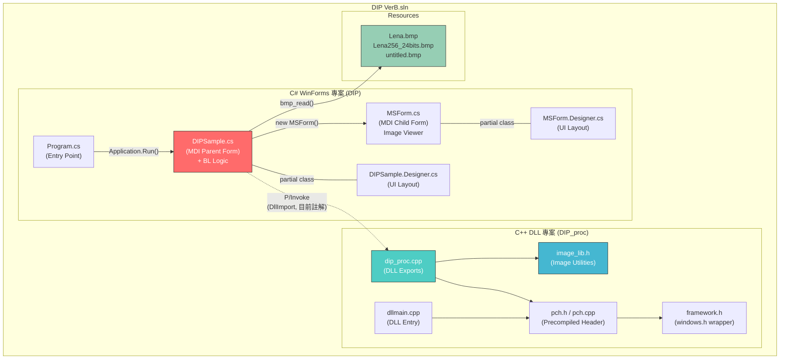

# DIP-MDI 專案完整靜態架構分析報告

---

## Step 1. 專案結構解析（Project Structure Analysis）

### 目錄樹（Directory Tree）

```
DIP-MDI/
├── DIP VerB.sln                    ← 🔧 Solution 檔（Visual Studio 2019/2022）
├── DIP.ncb                         ← 📦 IntelliSense 快取（legacy，VS2008 時代產物）
├── DIP.suo                         ← 📦 使用者選項檔（隱藏，legacy）
├── Lena.bmp                        ← 🖼️ 測試影像（經典 Lena 圖，灰階）
├── Lena256_24bits.bmp              ← 🖼️ 測試影像（Lena 256×256, 24-bit 彩色）
├── untitled.bmp                    ← 🖼️ 測試影像（其他範例圖檔）
├── Thumbs.db                       ← 📦 Windows 縮圖快取（可忽略）
│
├── DIP/                            ← 🖥️ **C# WinForms 主應用程式專案（UI 層）**
│   ├── DIP.csproj                  ← 🔧 C# 專案檔（.NET Framework 4.8, WinExe）
│   ├── Program.cs                  ← 🚀 應用程式進入點（Entry Point）
│   ├── DIPSample.cs                ← 🖥️ MDI 父表單（主視窗 + 影像處理邏輯）
│   ├── DIPSample.Designer.cs       ← 🖥️ DIPSample 表單設計器（UI Layout）
│   ├── DIPSample.resx              ← 📦 DIPSample 資源檔
│   ├── MSForm.cs                   ← 🖼️ MDI 子表單（影像顯示視窗）
│   ├── MSForm.Designer.cs          ← 🖼️ MSForm 表單設計器（UI Layout）
│   ├── MSForm.resx                 ← 📦 MSForm 資源檔
│   ├── app.config                  ← ⚙️ 應用程式組態（Target: .NET 4.8）
│   ├── DIP_proc.dll                ← 📦 Native DLL 副本（供執行時載入）
│   ├── DIP_proc.exp / .ilk / .lib / .pdb ← 📦 DLL 編譯中間產物
│   ├── Properties/                 ← ⚙️ 專案屬性
│   │   ├── AssemblyInfo.cs         ← 組件資訊
│   │   ├── Resources.Designer.cs   ← 自動產生的資源存取器
│   │   ├── Resources.resx          ← 資源定義檔
│   │   ├── Settings.Designer.cs    ← 自動產生的設定存取器
│   │   └── Settings.settings       ← 應用程式設定
│   ├── bin/                        ← 📦 編譯輸出（Debug/Release/x86）
│   └── obj/                        ← 📦 編譯中間檔
│
├── DIP_proc/                       ← ⚙️ **C++ Native DLL 專案（運算層）**
│   ├── DIP_proc.vcxproj            ← 🔧 C++ 專案檔（v143 工具鏈, DynamicLibrary）
│   ├── DIP_proc.vcxproj.filters    ← 🔧 專案篩選器
│   ├── DIP_proc.vcxproj.user       ← 🔧 使用者專案設定
│   ├── dip_proc.cpp                ← ⚙️ DLL 匯出函式（encode_gray 等）
│   ├── dllmain.cpp                 ← ⚙️ DLL 進入點（DllMain）
│   ├── image_lib.h                 ← 📚 影像處理工具函式庫（copy/contrast/block_get 等）
│   ├── framework.h                 ← 📚 Windows 標頭封裝
│   ├── pch.h                       ← 📚 先行編譯標頭（Precompiled Header）
│   ├── pch.cpp                     ← 📚 先行編譯標頭來源檔
│   └── Debug/                      ← 📦 C++ 編譯輸出
│
├── Debug/                          ← 📦 **Solution 層級 Debug 輸出**
│   ├── DIP_proc.dll / .exp / .lib / .pdb
│
└── .vs/                            ← 📦 Visual Studio 隱藏設定
```

### 層級分類摘要

| 層級 | 對應資料夾/檔案 | 說明 |
|------|-----------------|------|
| **UI 層** | `DIP/` (DIPSample, MSForm) | C# WinForms MDI 介面 |
| **Business Logic 層** | `DIP/DIPSample.cs` 中段 | 影像陣列轉換、像素運算（嵌入 UI 層中） |
| **Data / Processing 層** | `DIP_proc/` | C++ Native DLL，影像處理核心運算 |
| **Resource / Asset** | `*.bmp`, `*.resx`, `Properties/` | 測試圖檔、表單資源、組件設定 |

> [!IMPORTANT]
> 此專案**未嚴格分離** Business Logic 與 UI 層。影像轉換邏輯（`dyn_bmp2array` / `dyn_array2bmp`）直接寫在 `DIPSample.cs`（MDI 父表單）中，屬於典型的 **Smart UI Anti-pattern**。

---

## Step 2. AST / 靜態結構分析（Code Structure Interpretation）

### 2.1 Class / Module 角色總覽

| Class / Module | 檔案 | 語言 | 角色 | 主要責任（Responsibility） |
|----------------|------|------|------|---------------------------|
| `Program` | Program.cs | C# | Application Entry | 啟動 WinForms 應用程式，建立 `DIPSample` 主表單 |
| `DIPSample` | DIPSample.cs | C# | MDI Parent Form + Controller | 主視窗、選單系統、檔案開啟、影像處理觸發、Bitmap↔Array 轉換、P/Invoke 呼叫 |
| `MSForm` | MSForm.cs | C# | MDI Child Form (Image Viewer) | 單張影像顯示、視窗尺寸調整、滑鼠座標/像素值即時顯示 |
| `encode_gray` | dip_proc.cpp | C++ | DLL Export Function | 灰階編碼處理（*目前在 C# 端被註解*） |
| *(image_lib.h 函式群)* | image_lib.h | C++ | Utility Library | `copy`, `clip`, `round`, `contrast`, `block_get`, `block_put` 等底層影像運算 |
| `DllMain` | dllmain.cpp | C++ | DLL Entry Point | DLL 載入/卸載生命週期管理（標準空實作） |

### 2.2 架構模式判斷

```
┌─────────────────────────────────────────────────┐
│  此專案 ≠ MVC / MVP / MVVM                       │
│  此專案 ≈ Two-Tier (Smart UI + Native DLL)       │
│                                                   │
│  • UI 層（WinForms）直接包含 Business Logic       │
│  • 無獨立的 Model / Service / Repository 層       │
│  • C++ DLL 作為「效能加速插件」透過 P/Invoke 呼叫  │
└─────────────────────────────────────────────────┘
```

### 2.3 關鍵技術特徵

- **Unsafe Code（不安全程式碼）**：C# 端啟用 `AllowUnsafeBlocks`，使用 `fixed` 指標直接操作 `BitmapData`
- **P/Invoke（Platform Invocation）**：透過 `[DllImport("dip_proc.dll")]` 呼叫 C++ DLL
- **MDI（Multiple Document Interface）**：`DIPSample` 設定 `IsMdiContainer = true`，`MSForm` 為子視窗
- **Precompiled Header**：C++ 端使用 `pch.h` / `pch.cpp` 加速編譯

---

## Step 3. Dependency Graph（依賴關係）

### 3.1 模組依賴關係（Bullet List）

**C# 端（DIP 專案）：**
- `Program` → `DIPSample` （建立主視窗）
- `DIPSample` → `MSForm` （建立 MDI 子視窗）
- `DIPSample` → `DIP_proc.dll` （P/Invoke 呼叫 `encode_gray`，*目前被註解*）
- `DIPSample` → `System.Drawing` / `System.Drawing.Imaging` （Bitmap 操作）
- `DIPSample` → `System.Runtime.InteropServices` （DllImport）
- `DIPSample` → `System.Windows.Forms` （UI 元件）
- `MSForm` → `System.Drawing` / `System.Drawing.Imaging` （Bitmap 顯示）

**C++ 端（DIP_proc 專案）：**
- `dip_proc.cpp` → `pch.h` → `framework.h` → `<windows.h>`
- `dip_proc.cpp` → `image_lib.h` （影像處理工具函式）
- `dllmain.cpp` → `pch.h`

**核心模組（Core Modules）：**
- `DIPSample` — 系統樞紐，所有邏輯匯聚點
- `image_lib.h` — C++ 端核心影像處理函式庫

**資源/獨立模組（Resource / Isolated）：**
- `*.bmp` 測試圖檔 — 純資源
- `Properties/*` — 自動產生的設定/資源
- `dllmain.cpp` — 標準空殼 DLL 進入點
- `pch.h` / `pch.cpp` — 編譯基礎設施

### 3.2 Mermaid Dependency Diagram



---

## Step 4. Workflow 分析（System Workflow）

### 4.1 影像開啟流程（Image Open Flow）

```text
[使用者點擊 File → Open]
        ↓
[DIPSample.openToolStripMenuItem_Click]
        ↓
[OpenFileDialog 選擇 .bmp 檔案]
        ↓
[DIPSample.bmp_read() — 建立 Bitmap 物件]
        ↓
[建立 MSForm 子視窗 (MDI Child)]
  ├── 設定 MdiParent = DIPSample
  ├── 傳入 pBitmap (Bitmap 物件)
  └── 傳入 pf1 (StatusBar Label 參考)
        ↓
[MSForm.MSForm_Load]
  ├── bmp_dip() — 調整視窗尺寸 = 圖片尺寸
  └── 設定 StatusBar 顯示 (Width, Height)
        ↓
[PictureBox 顯示影像]
```

### 4.2 影像處理流程（Image Processing Flow — Negative/Invert）

```text
[使用者點擊 IP → RGBtoGray (或 fff)]
        ↓
[DIPSample.RGBtoGrayToolStripMenuItem_Click]
        ↓
[遍歷 MdiChildren，找到目前 Focused 的 MSForm]
        ↓
[DIPSample.dyn_bmp2array()]
  ├── Bitmap.LockBits() — 鎖定記憶體
  ├── unsafe 指標遍歷像素資料
  └── 輸出 int[] 一維陣列 (含 ByteDepth)
        ↓
[像素運算: g[i*w+j] = 255 - f[i*w+j]]
  └── (實際為 Negative/反相 運算，非真正 RGB→Gray)
        ↓
[DIPSample.dyn_array2bmp()]
  ├── 建立新 Bitmap 物件
  ├── unsafe 指標寫入像素資料
  └── 處理 Padding bytes (BMP Stride 對齊)
        ↓
[建立新 MSForm 子視窗顯示處理結果]
```

### 4.3 滑鼠互動流程（Mouse Interaction Flow）

```text
[使用者在 MSForm 的 PictureBox 上移動滑鼠]
        ↓
[MSForm.pictureBox1_MouseMove]
        ↓
[Bitmap.GetPixel(e.X, e.Y) — 取得像素 RGB 值]
        ↓
[更新 StatusBar: "(X,Y)=(R,G,B)"]
```

### 4.4 P/Invoke DLL 呼叫流程（*目前被註解*）

```text
[DIPSample — C# Managed Code]
        ↓
[DllImport("dip_proc.dll", Cdecl)]
        ↓
[encode_gray(int* f, int w, int h, int* g, int d)]
        ↓  (extern "C" — 避免 C++ name mangling)
[dip_proc.cpp — C++ Native Code]
        ↓
[image_lib.h 工具函式 (copy / contrast / block_get / block_put)]
```

> [!NOTE]
> `encode_gray` 的 P/Invoke 呼叫目前在 `DIPSample.cs` 中被**註解掉**（L154, L191），改用 C# 端的 inline 像素運算替代。此設計顯示 DLL 呼叫機制已建立但尚未啟用。

---

## Step 5. 檔案功能逐一說明

### 5.1 Solution 層級檔案

| 檔案 | 推測功能 | 所屬層級 | 依賴對象 |
|------|---------|---------|---------|
| `DIP VerB.sln` | Visual Studio Solution 檔，管理 2 個子專案 (DIP + DIP_proc) | 建置設定 | DIP.csproj, DIP_proc.vcxproj |
| `DIP.ncb` | IntelliSense 快取（VS2008 遺留產物），可安全刪除 | Legacy 快取 | 無 |
| `DIP.suo` | 使用者選項（視窗佈局、斷點等），可安全忽略 | IDE 設定 | 無 |
| `Lena.bmp` | 經典 Lena 測試影像（灰階，~66KB） | Resource | 無 |
| `Lena256_24bits.bmp` | Lena 測試影像（256×256, 24-bit 彩色，~196KB） | Resource | 無 |
| `untitled.bmp` | 其他測試影像（~60KB） | Resource | 無 |
| `Thumbs.db` | Windows 縮圖快取，可安全刪除 | 系統快取 | 無 |

### 5.2 C# 專案檔案（DIP/）

| 檔案 | 推測功能 | 所屬層級 | 依賴對象 |
|------|---------|---------|---------|
| `DIP.csproj` | C# 專案定義。Target: .NET Framework 4.8, OutputType: WinExe, AllowUnsafeBlocks: true。包含 DIP_proc.dll 作為 Content 並 CopyToOutputDirectory | 建置設定 | System.Drawing, System.Windows.Forms 等 |
| `Program.cs` | 應用程式進入點。`Main()` 啟動 `DIPSample` 表單 | UI 層 (Entry) | DIPSample |
| `DIPSample.cs` | **核心檔案**。MDI 父表單，包含：(1) 檔案開啟 `bmp_read` (2) Bitmap↔int[] 轉換 `dyn_bmp2array`/`dyn_array2bmp` (3) 影像處理觸發 (Negative) (4) P/Invoke 宣告 `encode_gray` (5) 選單事件處理 | UI + BL 混合層 | MSForm, DIP_proc.dll (P/Invoke), System.Drawing.Imaging, System.Runtime.InteropServices |
| `DIPSample.Designer.cs` | DIPSample 表單設計器自動產生程式碼。定義 MenuStrip（File→Open, IP→RGBtoGray/fff, ggg→hgggg）、StatusStrip、OpenFileDialog、SaveFileDialog | UI 層 (Layout) | System.Windows.Forms |
| `DIPSample.resx` | DIPSample 內嵌資源定義 | Resource | 無 |
| `MSForm.cs` | MDI 子表單。責任：(1) 接收並顯示 Bitmap 於 PictureBox (2) 調整視窗尺寸匹配圖片 (3) 滑鼠移動時即時顯示座標與像素 RGB 值 (4) 提供 `bmp_read`/`bmp_write` 方法（*部分與 DIPSample 重複*） | UI 層 (Viewer) | System.Drawing, System.Drawing.Imaging |
| `MSForm.Designer.cs` | MSForm 設計器。定義 PictureBox（Dock=Fill, CenterImage）、Fixed3D 邊框、MouseMove 事件 | UI 層 (Layout) | System.Windows.Forms |
| `MSForm.resx` | MSForm 內嵌資源定義 | Resource | 無 |
| `app.config` | 應用程式執行組態。指定 .NET Framework v4.0 runtime + v4.8 SKU | 設定 | 無 |
| `DIP_proc.dll` (在 DIP/ 中) | C++ Native DLL 的複本，建置時 CopyToOutputDirectory=PreserveNewest | 二進位依賴 | dip_proc.cpp 編譯產物 |
| `Properties/AssemblyInfo.cs` | 組件元資訊（版本號、公司名稱等） | 設定 | 無 |
| `Properties/Resources.*` | 專案資源管理（自動產生） | Resource | 無 |
| `Properties/Settings.*` | 應用程式設定管理（自動產生） | 設定 | 無 |

### 5.3 C++ DLL 專案檔案（DIP_proc/）

| 檔案 | 推測功能 | 所屬層級 | 依賴對象 |
|------|---------|---------|---------|
| `DIP_proc.vcxproj` | C++ 專案定義。ConfigurationType: DynamicLibrary, PlatformToolset: v143, OutputDir 設定為 `$(SolutionDir)DIP\`（直接輸出到 C# 專案目錄） | 建置設定 | windows.h, MSVC Toolchain |
| `dip_proc.cpp` | **DLL 核心**。以 `extern "C"` 匯出 `encode_gray()` 函式，使用 `__declspec(dllexport)` 標記。引入 `pch.h` 與 `image_lib.h` | Data Processing 層 | pch.h, image_lib.h |
| `dllmain.cpp` | DLL 進入點。標準 `DllMain` 空實作（處理 ATTACH/DETACH 事件） | 基礎設施 | pch.h |
| `image_lib.h` | **影像處理工具函式庫**（Header-only）。提供：`round()` — 四捨五入、`clip()` — 灰階值裁切 [0,255]、`copy()` — 影像複製、`block_get()` — 區塊讀取、`block_put()` — 區塊寫入、`contrast()` — 對比度調整（兩個多載版本） | Data Processing 層 | 無（獨立） |
| `framework.h` | Windows 標頭封裝。定義 `WIN32_LEAN_AND_MEAN` 並引入 `<windows.h>` | 基礎設施 | windows.h |
| `pch.h` | 先行編譯標頭定義。引入 `framework.h` | 基礎設施 | framework.h |
| `pch.cpp` | 先行編譯標頭來源檔（觸發 PCH 建立） | 基礎設施 | pch.h |

---

## 附錄：關鍵觀察與潛在問題

> [!WARNING]
> **程式碼異味（Code Smells）：**
> 1. `DIPSample.cs` 中 `RGBtoGrayToolStripMenuItem_Click` 與 `fffToolStripMenuItem_Click` 的實作**完全相同**（都是 Negative/反相運算），屬於重複程式碼
> 2. `MSForm.cs` 中的 `bmp_read()` 和 `bmp_write()` 方法與 `DIPSample.cs` 中的 `bmp_read()` 功能重疊
> 3. 選單項目命名（`fff`, `ggg`, `hgggg`）為佔位名稱，尚未正式定義
> 4. `image_lib.h` 中 `delete g` 應改為 `delete[] g`（陣列釋放語法錯誤）
> 5. `dyn_array2bmp` 假設影像為正方形（`Width = Height = sqrt(length/depth)`），對非正方形影像會產生錯誤結果

> [!NOTE]
> **架構特性總結：**
> - 典型的**教學用 legacy 專案**，以功能展示為導向
> - **雙語言混合架構**：C# WinForms (UI) + C++ DLL (Processing)
> - P/Invoke 呼叫機制已建立但目前被註解，C# 端自行實作像素運算
> - 無單元測試、無 IoC 容器、無日誌框架
> - `image_lib.h` 為 header-only library，包含實作（非僅宣告）
